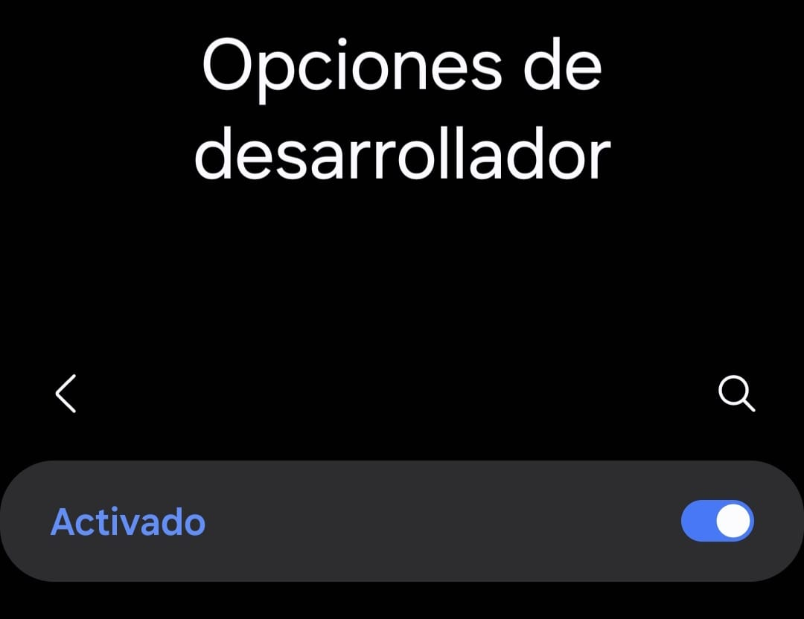
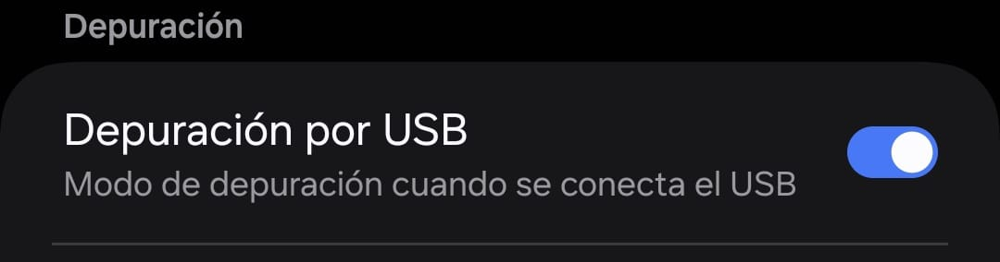
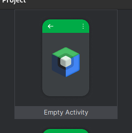
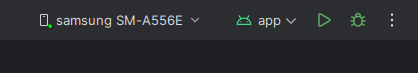
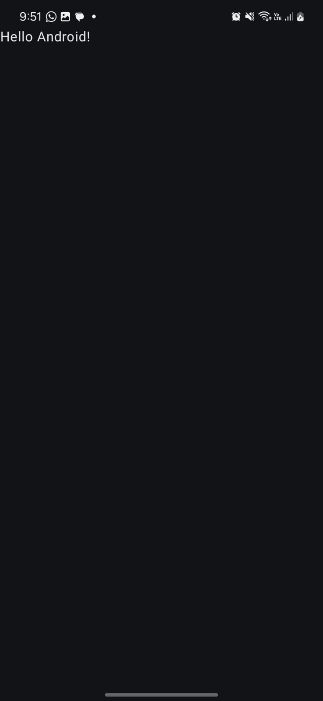

# CONEXION CELULAR(SAMSUNG) A ANDROID STUDIO POR USB

### 1. Habilitar las funciones de desarrollador en nuestro Samsung

Nos dirigimos a los **'ajustes'** del celular, ya en los ajustes, localizamos **'Acerca del telefono'**

Clickeamos, y localizamos **'Informacion de software'**

Clickeamos, localizamos **'Numero de compilacion'**

Lo clickeamos las veces necesarias hasta que nos habiliten las opciones de desarrollador.

### 2. Funciones de desarrollador

Cuando ya tengamos las opciones de desarrollador habilitadas, localizamos dentro de **'ajustes´** la seccion **'Opciones de Desarrollador'**

Ingresamos y activamos en caso de ser necesario las opciones de desarrollador

Dentro de las 'Opciones de desarrollador' localizamos la opcion **'Depuracion por USB'** y la activamos

### 3. Android Studio

En **'Android Studio'** creamos un nuevo proyecto con la configuracion **'Empty Activity'**

Ya creado el proyecto, mantenemos la configuracion del proyecto, procedemos a conectar el USB a nuestra computadora y celular.

Una vez ya conectado, damos permiso a todos los permisos de transmision de datos.

Ya concluido esto, el software ya detecto nuestro celular, aparecera de esta manera.

Corremos nuestro programa.

Nos mostrara en nuestro celular lo siguiente:

