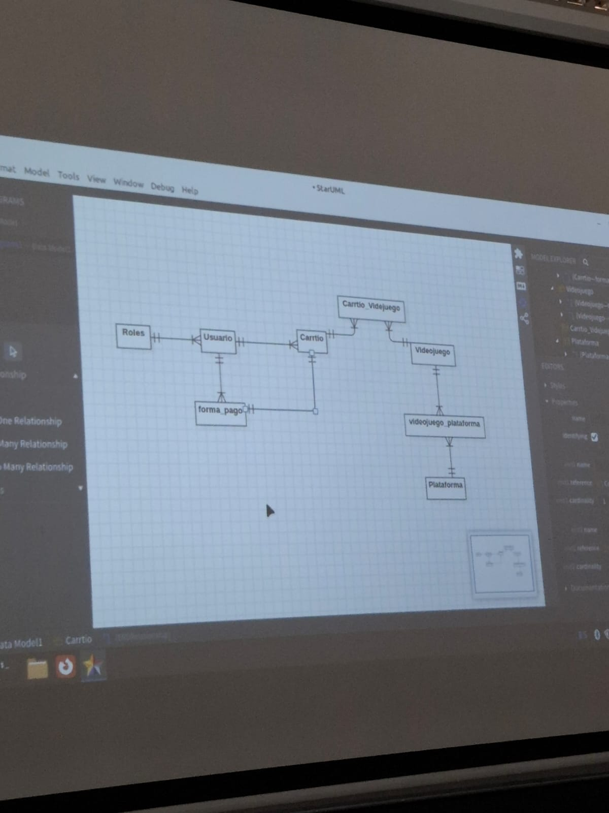

# DOCUMENTACION PROYECTO CARRITO DE JUEGOS

## Base de Datos Modelo

        Table roles {
        id_rol int(10) [pk]
        tipo varchar(50) [not null]

        }

        Table usuario {
        id_usuario int(10) [pk]
        nombre varchar(50) [not null]
        ap_paterno varchar(50) [not null]
        ap_materno varchar(50)  [not null]
        correo varchar(50) [not null]
        telefono int(10)
        username varchar(50) [not null]
        contrasena varchar(15) [not null]

        id_rol int(10)
        }

        Table pedido {
        id_pedido int(10) [pk]
        fecha datetime
        total int(10)
        
        id_usuario int(10)
        id_pago int(10)
        }

        Table pedido_videojuego {
        id_pedido int (10)
        id_videojuego int(10)

        cantidad int(10)
        }

        Table videojuego {
        id_videojuego int(10) [pk]  
        plataforma varchar(50) [not null]        
        titulo varchar(100) [not null]    
        imagen varchar(255) [not null]      
        trailer varchar(255) [not null]
        PRIMARY KEY (data_id)                               
        }

        Table consola{
        id_consola int(10) [pk]
        nombre varchar(10) [not null]
        }

        Table videojuego_consola{
        id_videojuego int(10)
        id_consola int(10)
        stock int(10)
        costo int(10)
        precio int(10)
        }

        Table pago{
        id_pago int(10) [pk]
        nombre_en_tarjeta varchar(50)
        numero int(16)
        vencimiento datetime

        id_usuario int(10)
        }

        Ref: usuario.id_rol > roles.id_rol
        Ref: pedido.id_usuario > usuario.id_usuario 
        Ref: pedido_videojuego.id_pedido > pedido.id_pedido
        Ref: pedido_videojuego.id_videojuego > videojuego.id_videojuego
        Ref: videojuego_consola.id_consola > consola.id_consola
        Ref: videojuego_consola.id_videojuego > videojuego.id_videojuego
        Ref: pago.id_usuario > usuario.id_usuario 
        Ref: pago.id_pago - pedido.id_pago