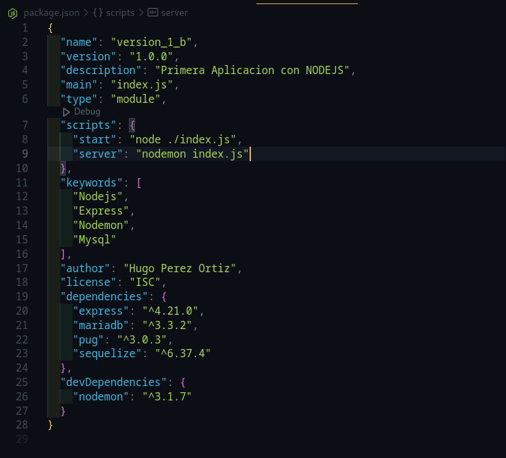

# Documentacion Paginas Web 2

## Terminal 

    i = install

**Instalacion paqueteria npm**

`npm i`

### Comando Version de Node Js
`node -v`

    
### Matar Terminal

**Revisar puertos (npm) abiertos**

`ps fea | grep npm`

**Revisar Puertos Abiertos (todos)**

`sudo lsof -i`

- Nos proporciona un (PID) el cual ocuparemos para matar la terminal

**Matar Terminal**

`kill -9 PID`

**Busqueda especificando el puerto**

`sudo lsof -i :puerto`

    
## Node js

> COMO INICIALIZAR UN DIRECTORIO 

### CONFIGURAR UN DIRECTORIO NODE JS (package.json)

**Dentro de un directorio, iniciamos el proyecto Node js...**
_(TERMINAL)_

**IMPORTANTE -> (No tocar: package-lock.json, node_modules)**

`npm init`

```
package name: Enter
version: Enter
description: Despcripcion
main: Enter
git repository: Enter

keywords: 
    Nodejs
    Express
    Nodemon
    Mysql

author: Autor
license: Enter

```

`npm i express`  

`npm i -D nodemon`

---

## Html a Pug

>Para este proyecto se usara la tecnologia de pug

`npm i pug`

**_Carpetas Proyecto_**

_Carpetas (OBLIGATORIAS) que se ocuparan para el proyecto_

- config
- controllers
- public
- routes
- views


## Package.json 

**Punto de Entrada**

**Modificaciones**



**Crear archivo `index.js` en el directorio principal**

> "main": "index.js"

**Para poder usar import**

> "type": "module"

**Configruar servidor - Agregar a package.json**

```js
"scripts" :{
    "start": "node ./index.js"
    "server": "nodemon index.js"
},
```
>

# Correr Servidor / Pagina (Terminal)

`npm run server`

**Matar el puerto**

`ctrl+c`

> Nota: Se debe matar la terminal, ya que si corremos el servidor en otra terminal, nos mostrara un error -> [¿Cómo matar terminal?](#matar-terminal)


**El servidor debe ser abierto con el puerto especificado**

Dentro del browser

[Local Host](http://localhost:2800/)


# Clase 2 (Por Terminar)

-- view terminal - key shortcut


Estudiar Bootstrap (Componentes disponibles en Bootstrap)
 - Copiar css bootstrap
 - Copiar javascript bootstrap


 Base de Datos
    Instalacion -- 

    *sudo mysql 
    -> Esta opcion es incorrecta

    *sudo mysql -u root -p 
    -> Configurar MariaDB -> Correcta Conexion
    
    *source esquema.sql;
    *use nombre_tabla ... Comandos

    (DESC nombre_tabla;) -> Estructura para mostrar la tabla -> Terminar con (;)


    *npm i sequelize mariadb 
    -> Dos comandos instalados en un comando


    - Como trabaja la informacion? Base de Datos
        Tabla a Objeto - Hacer Tablas a traves de Objetos (Mapeo)
            ORM - > Object Relational Map (Estudiar)

            Pool - > Conexiones - no Peticiones


    - models -> Nueva Carpeta
        Relacion de Base de Datos - Indicar mapeo de todas las tablas
        Como se debe comunicar con las tablas --

    + Privilegios de Root Mysql +

    Permiso de Root *
        sudo mysql -u root -p
        GRANT ALL PRIVILEGES ON *.* TO 'root'@'localhost' IDENTIFIED BY '1234';
        FLUSH PRIVILEGES;

Ctrl+C -> Salir de DB 
Ctrl+D -> Salir de MariaDb


Relaciones SQL ->

    LLaves Principales - Origen (PK)
    Llaves Secundarias - Destino (FK)

    Relacion 1 a 1:
        En alguna de las dos debe estar la foreign key
    
    Relacion 1 a muchos:
        La foreign key debe estar en la tabla de mayor cardinalidad 
    
    Relacion Muchos a Muchos
        La foreign key se debe estar en una tabla intermedia


    Lo mejor es que el la tabla prioritaria tenga la PK, la segunda tabla (puede tener una PK), pero lo mas 
    recomendable es que la segunda tabla tenga solo la FK de la primera tabla, para evitar errores !IMPORTANTE


Tarea: 
    10 - Oct:
        Insertar Consulta de Gerentes
        Insertar Consulta de Habitaciones


Configurar SQL